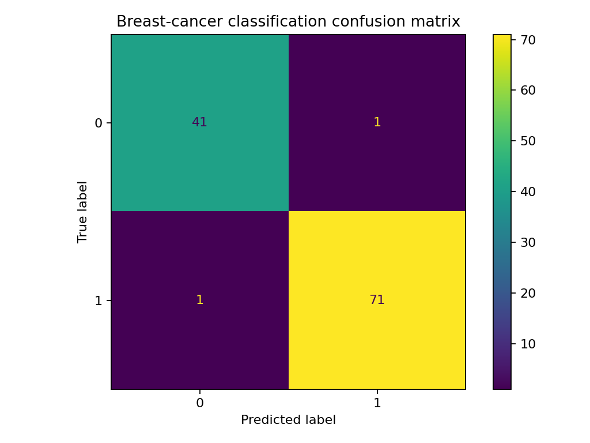
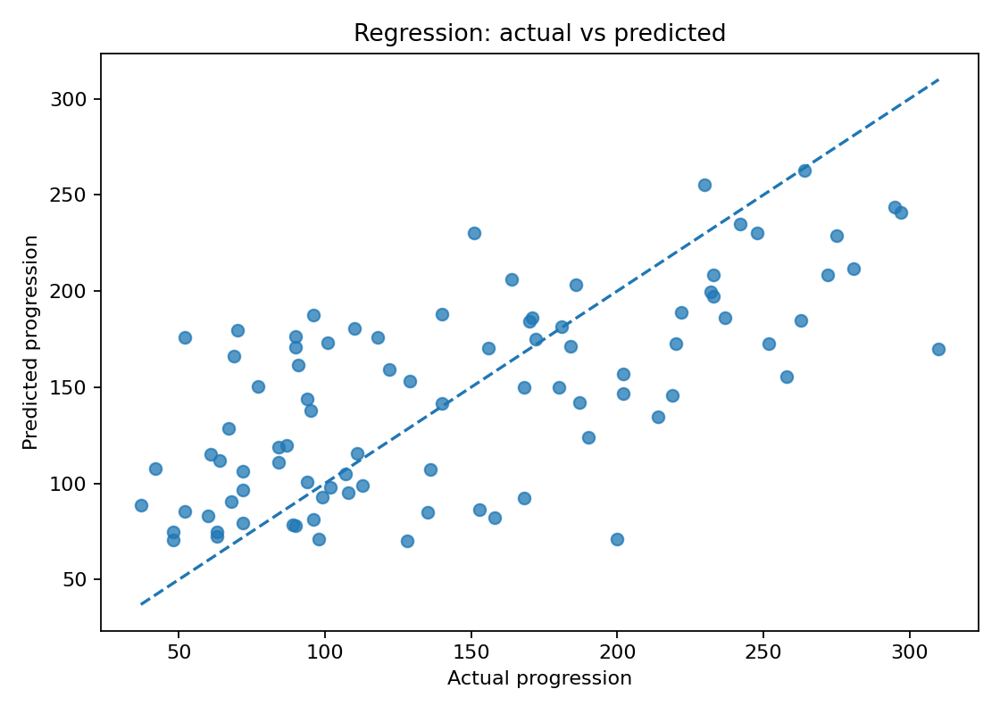
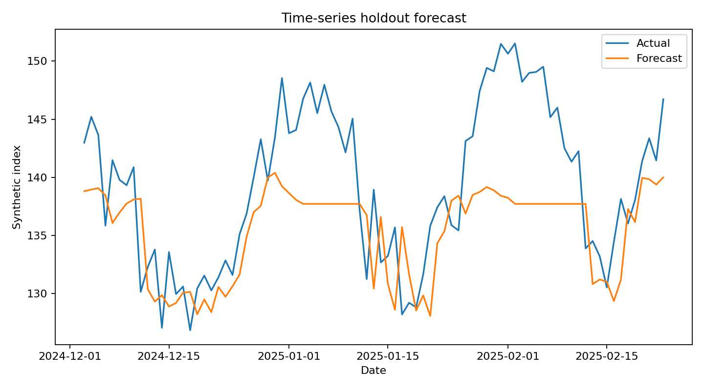

# Machine Learning and Data Analysis

A reproducible Python project demonstrating three common analytical workflows:

1. Breast-cancer classification
2. Diabetes progression regression
3. Synthetic time-series forecasting

The project uses datasets bundled with Scikit-learn or generated locally, so a reviewer can run it without downloading private data.

## Outputs

Running the pipeline creates:

- `outputs/metrics.json`
- `outputs/model_summary.csv`
- Classification confusion matrix
- Regression actual-vs-predicted chart
- Forecast actual-vs-predicted chart
- Feature-importance table where available

## Run

```bash
python -m venv .venv
.venv\Scripts\activate       # Windows
# source .venv/bin/activate  # macOS/Linux
pip install -r requirements.txt
python src/run_analysis.py
```

## Example outputs from the reproducible local pipeline







## Test

```bash
python -m unittest discover -s tests
```

## Interpretation

The output metrics are generated on the local run. Do not copy a result into a resume or interview answer without preserving the data split, random seed, and model configuration that produced it.

## Portfolio reconstruction

This repository converts the portfolio's broader ML/data-analysis experience into a transparent, runnable demonstration. It does not claim to recreate every original assessment dataset or result.
